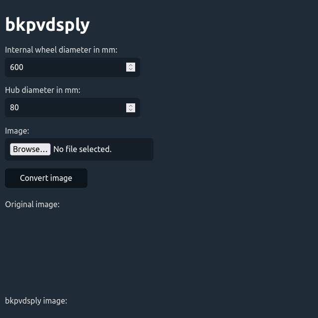
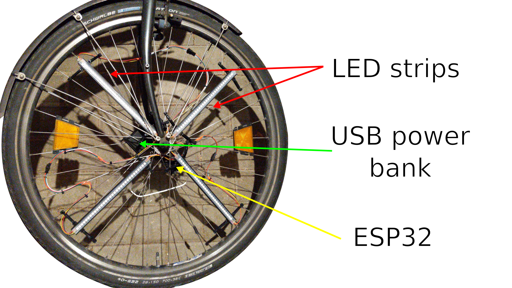
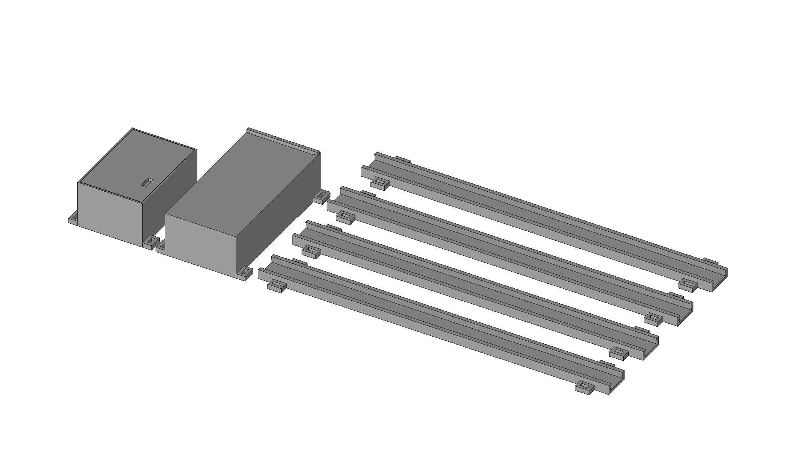

# bkpvdsply

## Overview

This is a bike POV display using readily available parts.

## Dependencies

I generally try to minimize dependencies, but I'm a one man crew and can therefore only support Linux Mint/Ubuntu as I'm running it myself. Anyway, you need to have the following packages installed for everything to work properly:

- Arduino IDE as a way to compile the Arduino code. Install it with `sudo apt install arduino`.
- Arduino ESP32 LittleFS uploader for uploading the data. Install it via the [installation guide](https://github.com/lorol/arduino-esp32fs-plugin).
- Adafruit NeoPixel library for controlling the LEDs. Install it via the integrated library manager.
- MPU6050_tockn library for communicating with the gyroscope. Install it via the integrated library manager.

## How to build it

This project is relatively straight forward as it mainly consists of an ESP32, an LED strip that's slit into four segments, a MPU-6050 and an USB power bank all housed in 3D printed enclosures and mounted with cable ties. For inspiration take a look at the mounting and assembly image down below.

Below is a full bill of materials with German sources for all non-printable parts:

| Quantity: | Item: | Source: |
| --- | --- | --- |
| 1 | ESP32 | [Amazon](https://www.amazon.de/AZDelivery-NodeMCU-Development-Nachfolgermodell-ESP8266/dp/B074RGW2VQ) |
| 1 | LED strip | [Amazon](https://www.amazon.de/CHINLY-Individuell-adressierbar-Traumfarbe-Wasserdicht/dp/B07TLHHJ75) |
| 8 | JST SM 3 pin connectors | [Amazon](https://www.amazon.de/YIXISI-M%C3%A4nnlichen-Weiblichen-Steckverbinder-Elektrisch/dp/B08JV8TJ9N) |
| 1 | MPU-6050 | [Amazon](https://www.amazon.de/AZDelivery-MPU-6050-3-Achsen-Gyroskop-Beschleunigungssensor-Arduino/dp/B07TKLYBD6) |
| 1 | USB power bank | [Amazon](https://www.amazon.de/dp/B01N1UX5JR) |
| 1 | Cable ties | [Amazon](https://www.amazon.de/Kabelbinder-Rscolila-Hochleistungs-Kabelmanagement-300mmx5mm/dp/B08ZC7PBSD) |
