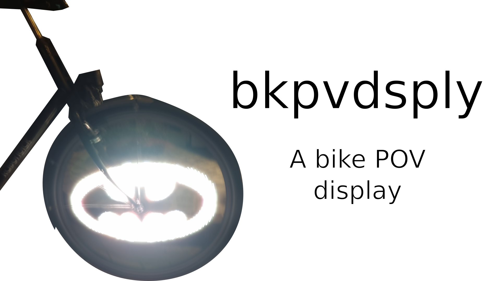

# bkpvdsply

## Overview

> Please keep in mind that this is a **work in progress**.

This is a bike POV display using readily available parts.

## Dependencies

I generally try to minimize dependencies, but I'm a one man crew and can therefore only support Ubuntu/Debian as I'm running it myself. Anyway, you need to have the following packages installed for everything to work properly:

- Arduino IDE as a way to compile the Arduino code. Install it with `sudo apt install arduino`.
- Arduino ESP8266 LittleFS uploader for uploading the data. Install it via the [installation guide](https://github.com/earlephilhower/arduino-esp8266littlefs-plugin).

## How to build it

Below is a full bill of materials with German sources for all non-printable parts:

| Quantity: | Item: | Source: |
| --- | --- | --- |
| 1 | ESP32 | [Amazon](https://www.amazon.de/AZDelivery-NodeMCU-Development-Nachfolgermodell-ESP8266/dp/B074RGW2VQ) |
| 1 | LED strip | [Amazon](https://www.amazon.de/CHINLY-Individuell-adressierbar-Traumfarbe-Wasserdicht/dp/B07TLHHJ75) |
| 1 | MPU-6050 | [Amazon](https://www.amazon.de/AZDelivery-MPU-6050-3-Achsen-Gyroskop-Beschleunigungssensor-Arduino/dp/B07TKLYBD6) |
| 1 | USB power bank | [Amazon](https://www.amazon.de/Intenso-Powerbank-Ladeger%C3%A4t-Smartphone-Digitalkamera-schwarz/dp/B07Z6N28RD) |
| 1 | Cable ties | [Amazon](https://www.amazon.de/Kabelbinder-Rscolila-Hochleistungs-Kabelmanagement-300mmx5mm/dp/B08ZC7PBSD) |
